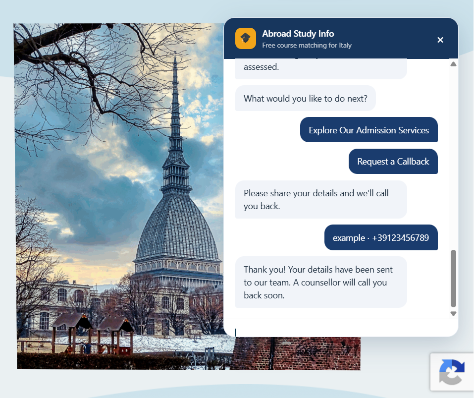
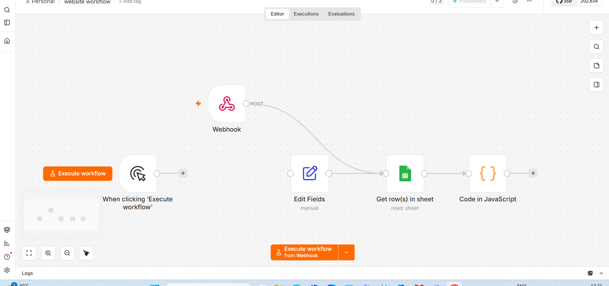
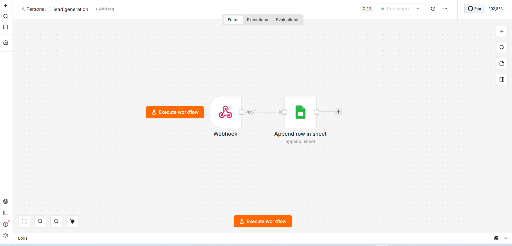
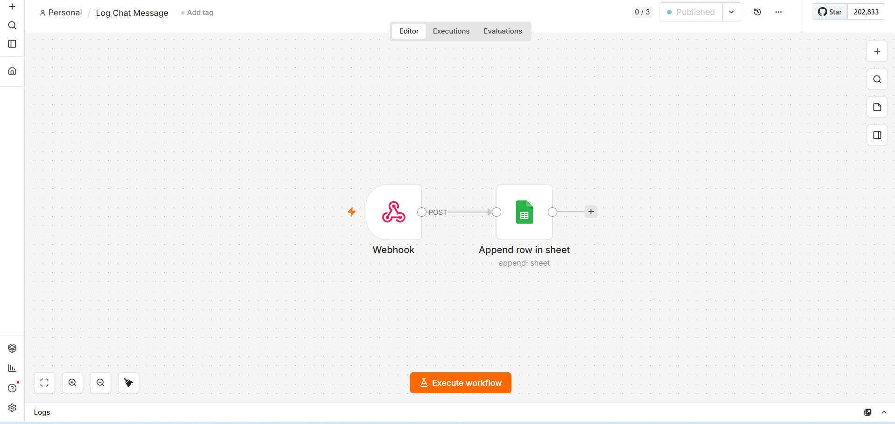

# Abroad Study Info — Course Finder & Lead Automation Platform

A **production-deployed full-stack automation system** built for AbroadStudyInfo.com. It combines a conversational web interface, self-hosted workflow orchestration, fuzzy course search and ranking, an **871-programme** catalogue, lead capture, conversation logging, and VPS/HTTPS infrastructure.

> **Project level: Advanced / Production Engineering** — this is an end-to-end deployed system, not only a chatbot UI.

The recommendation engine is deterministic and typo-tolerant rather than generative. Programme suggestions are returned only from the verified catalogue.

## Engineering scope

- **Full-stack integration:** WordPress/Elementor frontend connected to self-hosted n8n through HTTPS webhooks.
- **Workflow orchestration:** three independent backend workflows for course discovery, lead generation, and conversation logging.
- **Search & ranking:** custom JavaScript with normalization, tokenization, degree filtering, stop-word removal, Levenshtein typo tolerance, scoring, sorting, and top-5 selection.
- **Data integration:** Google Sheets programme catalogue plus separate operational lead and chat-log stores.
- **Infrastructure:** Ubuntu VPS, Docker, Nginx reverse proxy, DNS, HTTPS/TLS with Let's Encrypt, and production webhook routing.
- **Frontend engineering:** multi-step conversation state, asynchronous API calls, dynamic result rendering, validation, callback flow, WhatsApp handoff, and booking integration.
- **Reliability/debugging:** CORS/preflight, webhook lifecycle, response-mode, DOM timing, duplicate-ID, DNS, and concurrent logging issues were diagnosed and resolved during deployment.
- **Security/privacy:** public repository sanitized to remove production credentials, identifiers, contact data, server information, and private configuration.

## End-to-end user flow

A prospective student can:

1. select a degree level;
2. describe a study interest in free text;
3. provide academic background and intended intake;
4. provide an email address;
5. receive up to **5 ranked programme matches** from 871 Italian university programmes;
6. request admission support, a callback, WhatsApp contact, or a Q&A booking.

Behind the interface, the platform assigns a session ID, logs chatbot interactions, sends search requests to the matching workflow, and stores qualified callback leads for follow-up.

## Architecture

```text
Student
  |
  v
WordPress / Elementor UI
  |
WPCode JavaScript
  |
HTTPS / JSON
  v
Nginx Reverse Proxy
  |
Self-hosted n8n
  |------------------|------------------|
  v                  v                  v
Course Finder     Save Lead         Log Message
  |                  |                  |
  +------------ Google Sheets ----------+
  |
JavaScript fuzzy matching + ranking
  |
Top 5 verified programmes
  |
Chatbot result rendering
```

## Technology stack

| Layer | Technology |
|---|---|
| Website / UI | WordPress, Elementor |
| Frontend logic | JavaScript, DOM APIs, Fetch API, WPCode |
| Workflow backend | n8n |
| Search logic | JavaScript, Levenshtein distance, token-based ranking |
| Data layer | Google Sheets |
| Server | Ubuntu VPS |
| Containerization | Docker |
| Reverse proxy | Nginx |
| HTTPS | Let's Encrypt / Certbot |
| User handoff | WhatsApp and booking/calendar flow |

## Backend workflows

Three sanitized n8n workflows are included in [`workflows/`](workflows/):

| Workflow | Responsibility |
|---|---|
| [`course-finder.json`](workflows/course-finder.json) | Receives search requests, reads programme data, filters by degree, performs fuzzy ranking, and returns the strongest matches |
| [`save-lead.json`](workflows/save-lead.json) | Receives callback details and stores contact/search context |
| [`log-message.json`](workflows/log-message.json) | Records chatbot messages with session and timestamp information |

## Course-matching engine

The matching layer was designed for real student input rather than exact database wording. It:

1. normalizes degree and query values;
2. tokenizes the requested subject;
3. removes common filler words;
4. cleans and normalizes catalogue text;
5. compares query terms with course-name and department terms;
6. applies word-length-aware **Levenshtein distance** for typo tolerance;
7. scores and ranks candidates;
8. returns the five strongest verified matches.

This keeps recommendations grounded in the actual catalogue while tolerating misspellings and conversational queries.

## Production problems solved

| Problem | Resolution |
|---|---|
| Production webhook returned 404 | Corrected workflow activation/publishing behavior |
| Browser integration hit CORS/preflight errors | Corrected webhook origin configuration |
| DNS changes appeared ineffective | Identified and updated the authoritative DNS provider |
| Chat UI rendered incorrectly | Removed duplicate DOM IDs and consolidated the HTML shell |
| JavaScript could not bind UI elements | Delayed initialization until the Elementor DOM was available |
| Search returned empty/partial responses | Corrected n8n response timing and all-entry response settings |
| Exact searches failed on natural input | Replaced substring matching with token-based fuzzy matching |
| Chat log entries were occasionally lost | Serialized asynchronous logging through a Promise queue |
| Callback phone input accepted poor data | Added country-code handling and numeric validation |

## Screenshots

Full visual documentation is available in [`docs/screenshots/`](docs/screenshots/).

### Live chatbot


### Ranked programme recommendations


### Callback completion


### Course-search workflow


### Lead-generation workflow


### Conversation-logging workflow


## Repository structure

```text
.
├── README.md
├── SECURITY.md
├── .gitignore
├── src/
│   ├── README.md
│   └── course-finder-widget.js
├── workflows/
│   ├── README.md
│   ├── course-finder.json
│   ├── save-lead.json
│   └── log-message.json
├── data/
│   └── README.md
├── deployment/
│   └── README.md
└── docs/
    ├── PROJECT_REPORT.md
    ├── TECHNICAL_DOCUMENTATION.md
    └── screenshots/
```

## Reproducing the project

1. Prepare a Google Sheets course catalogue using the expected programme fields.
2. Import the three JSON workflows from `workflows/` into n8n.
3. Configure your own Google Sheets OAuth credential and spreadsheet/sheet values.
4. Expose the required n8n webhook endpoints over HTTPS.
5. Configure the endpoint/contact constants in `src/course-finder-widget.js`.
6. Add the expected chatbot HTML elements to the website.
7. Deploy the JavaScript through WPCode or an equivalent site-wide mechanism.
8. Test course search, typo handling, no-result behavior, logging, lead capture, callback validation, and production CORS behavior.

See [`deployment/README.md`](deployment/README.md) and [`docs/TECHNICAL_DOCUMENTATION.md`](docs/TECHNICAL_DOCUMENTATION.md) for implementation details.

## Privacy and security

The public repository intentionally excludes real leads, chat transcripts, OAuth tokens, spreadsheet IDs, VPS addresses, n8n instance/workflow identifiers, private phone numbers, booking links, and other environment-specific configuration. See [`SECURITY.md`](SECURITY.md).

## Future extensions

- Automated integration/regression tests around all three webhook flows.
- Rate limiting and stricter server-side payload validation.
- Email/CRM notifications for new qualified leads.
- Semantic retrieval/embedding search if future catalogue scale or search requirements justify it.

## Project status

**Production implementation completed and tested end-to-end:** course discovery, fuzzy ranking, live website integration, conversation logging, lead capture, callback flow, HTTPS deployment, and supporting infrastructure.

## Author

**Fiza Naeem**

Developed for Abroad Study Info — August 2026.
